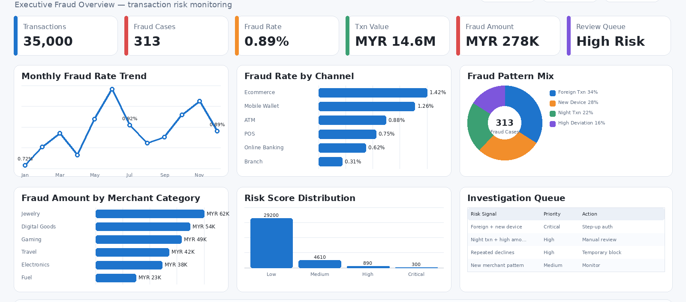
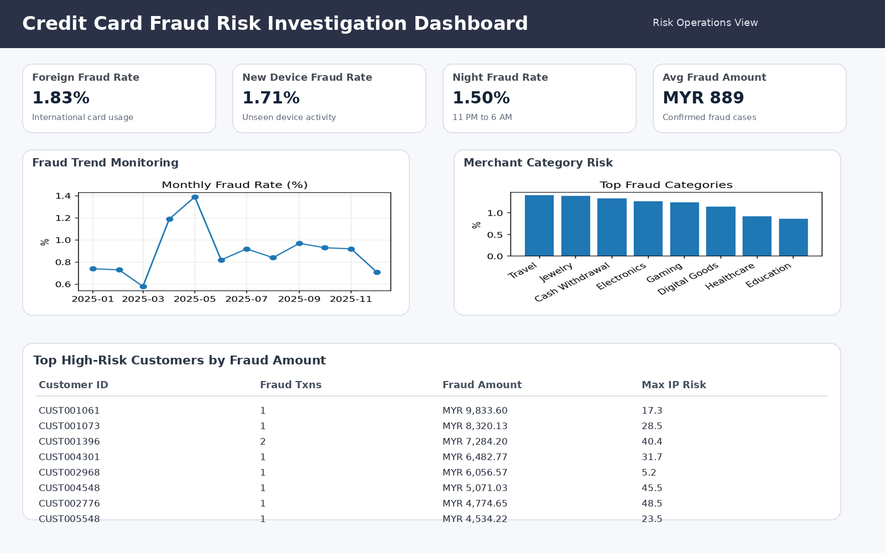

# Banking Credit Card Fraud Detection Analytics

End-to-end fraud detection project using SQL, Python (Random Forest), and Power BI — covering data generation, exploratory analysis, machine learning modelling, and interactive dashboards for fraud monitoring and risk investigation.

**Stack:** SQL · Python · scikit-learn · Power BI  
**Domain:** Financial Services · Fraud Risk Analytics

---

## Business Problem

Banks lose significant revenue to undetected credit card fraud. Fraud operations teams need to prioritise which cases to investigate, but fraud is rare — making pattern detection harder. This project identifies fraud signals across channel, merchant category, device type, geography, transaction velocity, and amount deviation to help teams focus on the highest-risk cases.

---

## Dataset

| Attribute | Value |
|---|---|
| Total Transactions | 35,000 |
| Total Columns | 34 |
| Fraud Cases | 313 |
| Fraud Rate | 0.89% |
| Total Transaction Value | MYR 14,596,307 |
| Total Fraud Amount | MYR 278,289 |
| Data Type | Synthetically generated to simulate real banking patterns |

---

## Project Structure

```
├── data/
│   ├── raw/                        # Raw transaction CSV
│   └── processed/                  # Cleaned and enriched dataset
├── notebooks/
│   ├── 01_generate_dataset.ipynb   # Synthetic data generation
│   ├── 02_eda_and_modelling.ipynb  # EDA, feature engineering, Random Forest
│   └── 03_dashboard_visuals.ipynb  # Chart exports for reporting
├── sql/
│   ├── 01_create_tables.sql        # Schema and indexing
│   ├── 02_data_quality_checks.sql  # Null checks, duplicate detection
│   └── 03_analytics_queries.sql    # KPI queries, fraud patterns
├── powerbi/
│   ├── PowerBI_DAX_Measures.md     # All DAX measure documentation
│   └── PowerBI_Build_Guide.md      # Dashboard build reference
└── README.md
```

---

## Tech Stack

| Tool | Purpose |
|---|---|
| SQL | Schema creation, data quality checks, fraud analytics queries |
| Python (pandas, NumPy) | Data cleaning, EDA, feature engineering |
| scikit-learn | Random Forest classifier, model evaluation |
| Matplotlib / Seaborn | Exploratory visualisations |
| Power BI + DAX | Executive and risk investigation dashboards |

---

## Feature Engineering

Key risk features engineered for the model:

| Feature | Description |
|---|---|
| `amount_deviation` | Difference from customer's average spend |
| `velocity_flag` | Multiple transactions within a short window |
| `new_device_flag` | Transaction from a device not seen before |
| `foreign_transaction_flag` | Country differs from customer's registered location |
| `time_of_day_flag` | Late-night transaction (11 PM – 2 AM) |
| `decline_history_flag` | Prior decline attempts on the same card |

---

## SQL Analytics

- Table creation and indexing
- Data quality checks (null rates, duplicate detection)
- KPI summary: fraud rate, total fraud amount, monthly trend
- Fraud breakdown by channel, merchant category, device type
- Top high-risk customer table ranked by composite risk score
- Hour-of-day and day-of-week fraud concentration

---

## Power BI Dashboards

### Page 1 — Executive Fraud Overview

KPI cards · Monthly fraud trend · Fraud rate by channel · Fraud amount by merchant category · Pattern donut chart

[

### Page 2 — Risk Investigation View

High-risk customer table · Merchant category risk chart · Country risk map · Transaction hour/day heatmap

[

---

## Key Insights

1. Fraud concentrates around foreign transactions combined with new devices — this combination is disproportionately represented in flagged cases.
2. Ecommerce and mobile wallet channels carry the highest fraud risk due to card-not-present exposure.
3. High-risk merchant categories: Jewellery, Digital Goods, Gaming, Travel, and Electronics.
4. Small transactions can still be high-risk — fraudsters often test cards with micro-transactions before larger attempts.
5. Combining multiple risk signals into a composite score outperforms any single rule-based flag.

---

## Business Recommendations

| Area | Recommendation |
|---|---|
| Transaction Monitoring | Flag combinations of new device + foreign country + high amount deviation |
| Authentication | Trigger step-up verification for abnormal transaction patterns |
| Fraud Operations | Build tiered investigation queues by risk score (High / Critical) |
| Customer Alerts | Notify customers on suspicious night-time or foreign transactions |
| Merchant Risk | Increase monitoring for repeatedly exposed merchant categories |
| Model Maintenance | Track fraud rate, false positives, and model drift monthly |

---

## Getting Started

```bash
pip install pandas numpy scikit-learn matplotlib seaborn jupyter

# Run notebooks in order
jupyter notebook notebooks/01_generate_dataset.ipynb
jupyter notebook notebooks/02_eda_and_modelling.ipynb
```

For SQL: run scripts in order — `01_create_tables.sql` → `02_data_quality_checks.sql` → `03_analytics_queries.sql`

---

## Author

**Revathy Shanmugaraj** · [github.com/Revashan](https://github.com/Revashan)
